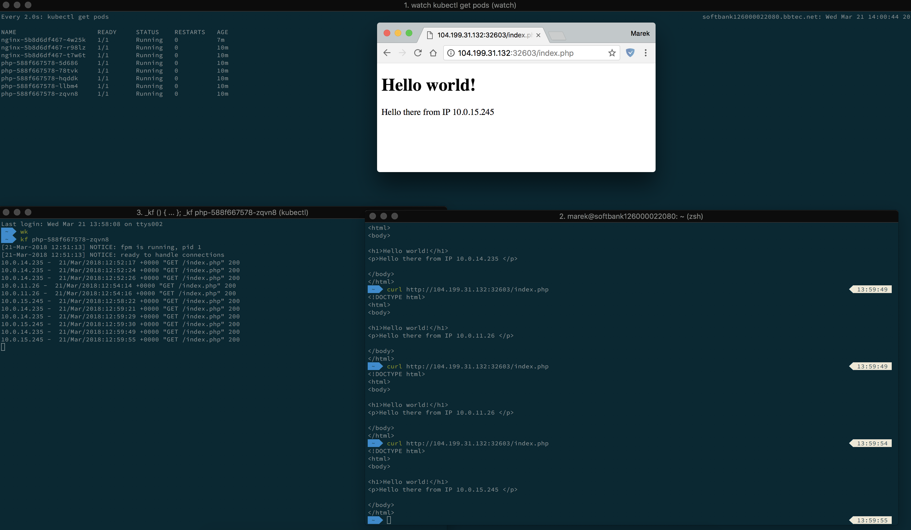

# gke-test

Example php app showing the private IP of running pod
- nginx + php 7.1 fpm as separate kubernetes deployments (with several replicas each, independent scaling), see `nginx.yaml` and `php.yaml`
- ingress resource, see `ingress.yaml`
- DNS record is automatically pushed to cloudflare, see `externaldns.yaml`
- automagically deployed using Google Cloud Builder, see `cloudbuild.yaml`
- provisioned GKE, see `cluster.yaml` and jinja files

